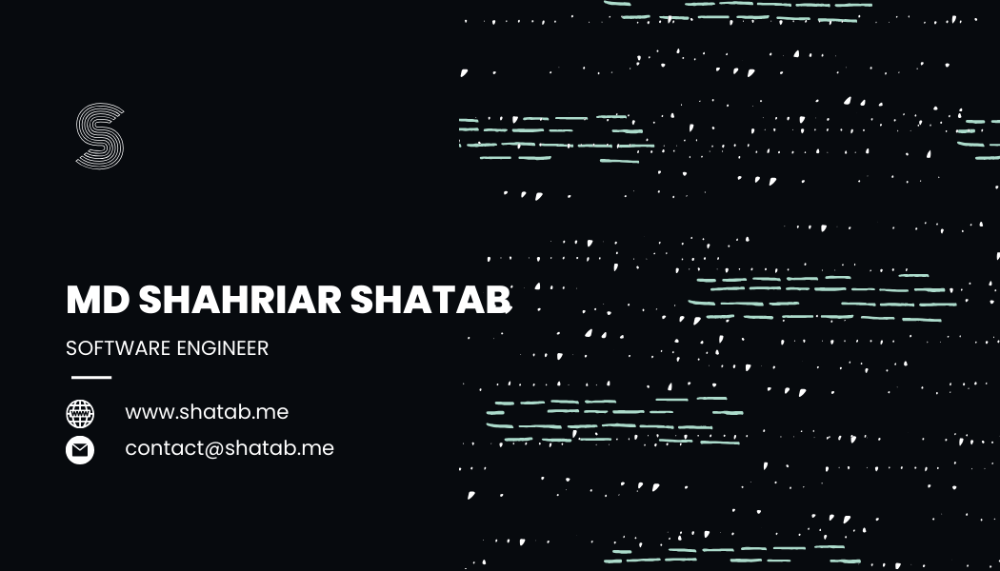

## Hi There, I am Software Engineer 🛠️ 


 

 ## Overview
```bash
## Overview

-> FOCUS:           Scalable Architecture, AI Integration & Cloud Security.
-> PHILOSOPHY:      Code that solves the problem, stripped of the fluff.
-> CURRENT_MISSION: Architecting intelligent, high-performance systems.

# I bring 2.5 years of hands-on experience bridging robust backend engineering 
# (Node.js/TypeScript) with modern AI solutions (FastAPI/RAG). I build, deploy, 
# and secure infrastructure that holds up under pressure using Docker, Kubernetes, 
# and strict VPC networking.
```

 <p>
   <a href="https://www.shatab.me/" target="_blank">Learn more from my portfolio</a> 
   or mail me at <a href="mailto:contact@shatab.me" target="_blank">contact@shatab.me</a>
 </p>

---

 ## Techonology I work with

<div>
<table>
    <tr>
        <td><strong>Backend</strong></td>
        <td>
            
            <!--  -->
            
            
        </td>
    </tr>
    <tr>
        <td><strong>Frontend</strong></td>
        <td>
            
            
            
        </td>
    </tr>
    <tr>
        <td><strong>Database</strong></td>
        <td>
            
            
            
        </td>
    </tr>
    <tr>
        <td><strong>Database & ORM</strong></td>
        <td>
            
            
            
            
        </td>
    </tr>
    <tr>
        <td><strong>Auth & BaaS</strong></td>
        <td>
            
            
            
        </td>
    </tr>
<tr>
  <td><strong>Cloud & Tools</strong></td>
  <td>
    
    
    
    
    
    
    
    
  </td>
</tr>
<tr>
  <td><strong>AI & Vector Database</strong></td>
  <td>
    
    
    
    
  </td>
</tr>

</table>
</div>

---

## Language I use to


## 💼 Experience

#### 🏢 ERPCAP (USA) — *Project Intern*   [📍 Remote | 🗓️ May 2024 – June 2024 ] 

#### 🏢 ClooudGen — *Full Stack Software Engineer*   [📍 Remote | 🗓️ December 2024 – May 2025  ]
#### 🏢 SM-Technology — *Backend Engineer*   [📍 On-site | 🗓️ June 2025 – August 2025  ]
#### 🏢 ERPCAP(USA) — *Full Stack Software Engineer*   [📍 Remote | 🗓️ September 2025 – Running  ]

---

## Backend projects 

### Online university management system  .
<div>
    <a href="https://github.com/Shatab99/Student-University-With-TS.git">Github</a></br>
    <a href="https://student-university-with-ts.vercel.app/">Live Server</a>
</div>

### Online Bike Renting center .

<div>
    <a href="https://github.com/Shatab99/Bike-service-ts.git">Github</a> </br>
    <a href="https://riding-bike.vercel.app/">Live Server</a></br>
</div>
<div>
    </br>
</div>

## Enola Voice Assistant (Still Developing) 

<div>
    👉&nbsp;&nbsp;<a href="https://github.com/Shatab99/Enola-Voice-assistant.git">Github</a> </br>
</div>
<div>
    </br>
</div>

## Full Stack Projects are pinned here (With live server) 👇 
